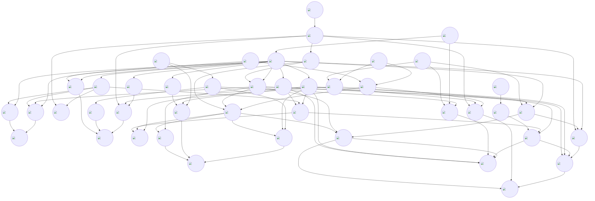

```mermaid
graph TD

LOGISTIC_SCIENCE_PACK(( <img src='https://wiki.factorio.com/images/thumb/Logistic_science_pack.png/32px-Logistic_science_pack.png' /> ))
TRANSPORT_BELT(( <img src='https://wiki.factorio.com/images/thumb/Transport_belt.png/32px-Transport_belt.png' /> ))
IRON_PLATE(( <img src='https://wiki.factorio.com/images/thumb/Iron_plate.png/32px-Iron_plate.png' /> ))
IRON_ORE(( <img src='https://wiki.factorio.com/images/thumb/Iron_ore.png/32px-Iron_ore.png' /> ))
IRON_GEAR_WHEEL(( <img src='https://wiki.factorio.com/images/thumb/Iron_gear_wheel.png/32px-Iron_gear_wheel.png' /> ))
INSERTER(( <img src='https://wiki.factorio.com/images/thumb/Inserter.png/32px-Inserter.png' /> ))
ELECTRONIC_CIRCUIT(( <img src='https://wiki.factorio.com/images/thumb/Electronic_circuit.png/32px-Electronic_circuit.png' /> ))
COPPER_CABLE(( <img src='https://wiki.factorio.com/images/thumb/Copper_cable.png/32px-Copper_cable.png' /> ))
COPPER_PLATE(( <img src='https://wiki.factorio.com/images/thumb/Copper_plate.png/32px-Copper_plate.png' /> ))
COPPER_ORE(( <img src='https://wiki.factorio.com/images/thumb/Copper_ore.png/32px-Copper_ore.png' /> ))
AUTOMATION_SCIENCE_PACK(( <img src='https://wiki.factorio.com/images/thumb/Automation_science_pack.png/32px-Automation_science_pack.png' /> ))
MILITARY_SCIENCE_PACK(( <img src='https://wiki.factorio.com/images/thumb/Military_science_pack.png/32px-Military_science_pack.png' /> ))
PIERCING_ROUNDS_MAGAZINE(( <img src='https://wiki.factorio.com/images/thumb/Piercing_rounds_magazine.png/32px-Piercing_rounds_magazine.png' /> ))
STEEL_PLATE(( <img src='https://wiki.factorio.com/images/thumb/Steel_plate.png/32px-Steel_plate.png' /> ))
FIREARM_MAGAZINE(( <img src='https://wiki.factorio.com/images/thumb/Firearm_magazine.png/32px-Firearm_magazine.png' /> ))
GRENADE(( <img src='https://wiki.factorio.com/images/thumb/Grenade.png/32px-Grenade.png' /> ))
COAL(( <img src='https://wiki.factorio.com/images/thumb/Coal.png/32px-Coal.png' /> ))
WALL(( <img src='https://wiki.factorio.com/images/thumb/Wall.png/32px-Wall.png' /> ))
STONE_BRICK(( <img src='https://wiki.factorio.com/images/thumb/Stone_brick.png/32px-Stone_brick.png' /> ))
STONE(( <img src='https://wiki.factorio.com/images/thumb/Stone.png/32px-Stone.png' /> ))
CHEMICAL_SCIENCE_PACK(( <img src='https://wiki.factorio.com/images/thumb/Chemical_science_pack.png/32px-Chemical_science_pack.png' /> ))
SULFUR(( <img src='https://wiki.factorio.com/images/thumb/Sulfur.png/32px-Sulfur.png' /> ))
WATER(( <img src='https://wiki.factorio.com/images/thumb/Water.png/32px-Water.png' /> ))
PETROLEUM_GAS(( <img src='https://wiki.factorio.com/images/thumb/Petroleum_gas.png/32px-Petroleum_gas.png' /> ))
ADVANCED_CIRCUIT(( <img src='https://wiki.factorio.com/images/thumb/Advanced_circuit.png/32px-Advanced_circuit.png' /> ))
PLASTIC_BAR(( <img src='https://wiki.factorio.com/images/thumb/Plastic_bar.png/32px-Plastic_bar.png' /> ))
ENGINE_UNIT(( <img src='https://wiki.factorio.com/images/thumb/Engine_unit.png/32px-Engine_unit.png' /> ))
PIPE(( <img src='https://wiki.factorio.com/images/thumb/Pipe.png/32px-Pipe.png' /> ))
PRODUCTION_SCIENCE_PACK(( <img src='https://wiki.factorio.com/images/thumb/Production_science_pack.png/32px-Production_science_pack.png' /> ))
RAIL(( <img src='https://wiki.factorio.com/images/thumb/Straight_rail.png/32px-Straight_rail.png' /> ))
IRON_STICK(( <img src='https://wiki.factorio.com/images/thumb/Iron_stick.png/32px-Iron_stick.png' /> ))
ELECTRIC_FURNACE(( <img src='https://wiki.factorio.com/images/thumb/Electric_furnace.png/32px-Electric_furnace.png' /> ))
PRODUCTIVITY_MODULE(( <img src='https://wiki.factorio.com/images/thumb/Productivity_module.png/32px-Productivity_module.png' /> ))
UTILITY_SCIENCE_PACK(( <img src='https://wiki.factorio.com/images/thumb/Utility_science_pack.png/32px-Utility_science_pack.png' /> ))
PROCESSING_UNIT(( <img src='https://wiki.factorio.com/images/thumb/Processing_unit.png/32px-Processing_unit.png' /> ))
SULFURIC_ACID(( <img src='https://wiki.factorio.com/images/thumb/Sulfuric_acid.png/32px-Sulfuric_acid.png' /> ))
FLYING_ROBOT_FRAME(( <img src='https://wiki.factorio.com/images/thumb/Flying_robot_frame.png/32px-Flying_robot_frame.png' /> ))
BATTERY(( <img src='https://wiki.factorio.com/images/thumb/Battery.png/32px-Battery.png' /> ))
ELECTRIC_ENGINE_UNIT(( <img src='https://wiki.factorio.com/images/thumb/Electric_engine_unit.png/32px-Electric_engine_unit.png' /> ))
LUBRICANT(( <img src='https://wiki.factorio.com/images/thumb/Lubricant.png/32px-Lubricant.png' /> ))
HEAVY_OIL(( <img src='https://wiki.factorio.com/images/thumb/Heavy_oil.png/32px-Heavy_oil.png' /> ))
LOW_DENSITY_STRUCTURE(( <img src='https://wiki.factorio.com/images/thumb/Low_density_structure.png/32px-Low_density_structure.png' /> ))
ROCKET_SILO(( <img src='https://wiki.factorio.com/images/thumb/Rocket_silo.png/32px-Rocket_silo.png' /> ))
CONCRETE(( <img src='https://wiki.factorio.com/images/thumb/Concrete.png/32px-Concrete.png' /> ))


INSERTER                                           --> LOGISTIC_SCIENCE_PACK
TRANSPORT_BELT                                     --> LOGISTIC_SCIENCE_PACK
IRON_PLATE                                         --> TRANSPORT_BELT
IRON_GEAR_WHEEL                                    --> TRANSPORT_BELT
IRON_ORE                                           --> IRON_PLATE
IRON_PLATE                                         --> IRON_GEAR_WHEEL
IRON_PLATE                                         --> INSERTER
ELECTRONIC_CIRCUIT                                 --> INSERTER
IRON_GEAR_WHEEL                                    --> INSERTER
IRON_PLATE                                         --> ELECTRONIC_CIRCUIT
COPPER_CABLE                                       --> ELECTRONIC_CIRCUIT
COPPER_PLATE                                       --> COPPER_CABLE
COPPER_ORE                                         --> COPPER_PLATE
IRON_GEAR_WHEEL                                    --> AUTOMATION_SCIENCE_PACK
COPPER_PLATE                                       --> AUTOMATION_SCIENCE_PACK
PIERCING_ROUNDS_MAGAZINE                           --> MILITARY_SCIENCE_PACK
WALL                                               --> MILITARY_SCIENCE_PACK
GRENADE                                            --> MILITARY_SCIENCE_PACK
FIREARM_MAGAZINE                                   --> PIERCING_ROUNDS_MAGAZINE
STEEL_PLATE                                        --> PIERCING_ROUNDS_MAGAZINE
COPPER_PLATE                                       --> PIERCING_ROUNDS_MAGAZINE
IRON_PLATE                                         --> STEEL_PLATE
IRON_PLATE                                         --> FIREARM_MAGAZINE
IRON_PLATE                                         --> GRENADE
COAL                                               --> GRENADE
STONE_BRICK                                        --> WALL
STONE                                              --> STONE_BRICK
SULFUR                                             --> CHEMICAL_SCIENCE_PACK
ADVANCED_CIRCUIT                                   --> CHEMICAL_SCIENCE_PACK
ENGINE_UNIT                                        --> CHEMICAL_SCIENCE_PACK
PETROLEUM_GAS                                      --> SULFUR
WATER                                              --> SULFUR
PLASTIC_BAR                                        --> ADVANCED_CIRCUIT
ELECTRONIC_CIRCUIT                                 --> ADVANCED_CIRCUIT
COPPER_CABLE                                       --> ADVANCED_CIRCUIT
PETROLEUM_GAS                                      --> PLASTIC_BAR
COAL                                               --> PLASTIC_BAR
STEEL_PLATE                                        --> ENGINE_UNIT
IRON_GEAR_WHEEL                                    --> ENGINE_UNIT
PIPE                                               --> ENGINE_UNIT
IRON_PLATE                                         --> PIPE
ELECTRIC_FURNACE                                   --> PRODUCTION_SCIENCE_PACK
RAIL                                               --> PRODUCTION_SCIENCE_PACK
PRODUCTIVITY_MODULE                                --> PRODUCTION_SCIENCE_PACK
STONE                                              --> RAIL
STEEL_PLATE                                        --> RAIL
IRON_STICK                                         --> RAIL
IRON_PLATE                                         --> IRON_STICK
STONE_BRICK                                        --> ELECTRIC_FURNACE
STEEL_PLATE                                        --> ELECTRIC_FURNACE
ADVANCED_CIRCUIT                                   --> ELECTRIC_FURNACE
ELECTRONIC_CIRCUIT                                 --> PRODUCTIVITY_MODULE
ADVANCED_CIRCUIT                                   --> PRODUCTIVITY_MODULE
FLYING_ROBOT_FRAME                                 --> UTILITY_SCIENCE_PACK
LOW_DENSITY_STRUCTURE                              --> UTILITY_SCIENCE_PACK
PROCESSING_UNIT                                    --> UTILITY_SCIENCE_PACK
SULFURIC_ACID                                      --> PROCESSING_UNIT
ELECTRONIC_CIRCUIT                                 --> PROCESSING_UNIT
ADVANCED_CIRCUIT                                   --> PROCESSING_UNIT
IRON_PLATE                                         --> SULFURIC_ACID
SULFUR                                             --> SULFURIC_ACID
WATER                                              --> SULFURIC_ACID
BATTERY                                            --> FLYING_ROBOT_FRAME
ELECTRIC_ENGINE_UNIT                               --> FLYING_ROBOT_FRAME
STEEL_PLATE                                        --> FLYING_ROBOT_FRAME
ELECTRONIC_CIRCUIT                                 --> FLYING_ROBOT_FRAME
IRON_PLATE                                         --> BATTERY
SULFURIC_ACID                                      --> BATTERY
COPPER_PLATE                                       --> BATTERY
ELECTRONIC_CIRCUIT                                 --> ELECTRIC_ENGINE_UNIT
ENGINE_UNIT                                        --> ELECTRIC_ENGINE_UNIT
LUBRICANT                                          --> ELECTRIC_ENGINE_UNIT
HEAVY_OIL                                          --> LUBRICANT
PLASTIC_BAR                                        --> LOW_DENSITY_STRUCTURE
STEEL_PLATE                                        --> LOW_DENSITY_STRUCTURE
COPPER_PLATE                                       --> LOW_DENSITY_STRUCTURE
PROCESSING_UNIT                                    --> ROCKET_SILO
ELECTRIC_ENGINE_UNIT                               --> ROCKET_SILO
CONCRETE                                           --> ROCKET_SILO
STEEL_PLATE                                        --> ROCKET_SILO
PIPE                                               --> ROCKET_SILO
STONE_BRICK                                        --> CONCRETE
IRON_ORE                                           --> CONCRETE
WATER                                              --> CONCRETE


```
