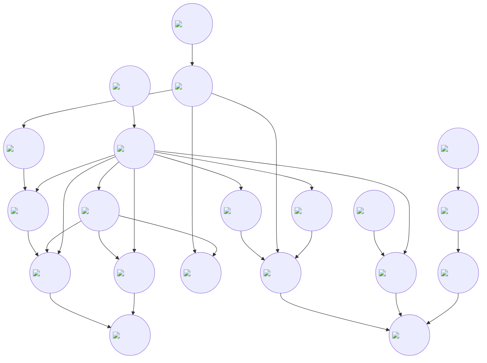

```mermaid
graph TD

LOGISTIC_SCIENCE_PACK(( <img src='https://wiki.factorio.com/images/thumb/Logistic_science_pack.png/32px-Logistic_science_pack.png' /> ))
TRANSPORT_BELT(( <img src='https://wiki.factorio.com/images/thumb/Transport_belt.png/32px-Transport_belt.png' /> ))
IRON_PLATE(( <img src='https://wiki.factorio.com/images/thumb/Iron_plate.png/32px-Iron_plate.png' /> ))
IRON_ORE(( <img src='https://wiki.factorio.com/images/thumb/Iron_ore.png/32px-Iron_ore.png' /> ))
IRON_GEAR_WHEEL(( <img src='https://wiki.factorio.com/images/thumb/Iron_gear_wheel.png/32px-Iron_gear_wheel.png' /> ))
INSERTER(( <img src='https://wiki.factorio.com/images/thumb/Inserter.png/32px-Inserter.png' /> ))
ELECTRONIC_CIRCUIT(( <img src='https://wiki.factorio.com/images/thumb/Electronic_circuit.png/32px-Electronic_circuit.png' /> ))
COPPER_CABLE(( <img src='https://wiki.factorio.com/images/thumb/Copper_cable.png/32px-Copper_cable.png' /> ))
COPPER_PLATE(( <img src='https://wiki.factorio.com/images/thumb/Copper_plate.png/32px-Copper_plate.png' /> ))
COPPER_ORE(( <img src='https://wiki.factorio.com/images/thumb/Copper_ore.png/32px-Copper_ore.png' /> ))
AUTOMATION_SCIENCE_PACK(( <img src='https://wiki.factorio.com/images/thumb/Automation_science_pack.png/32px-Automation_science_pack.png' /> ))
MILITARY_SCIENCE_PACK(( <img src='https://wiki.factorio.com/images/thumb/Military_science_pack.png/32px-Military_science_pack.png' /> ))
PIERCING_ROUNDS_MAGAZINE(( <img src='https://wiki.factorio.com/images/thumb/Piercing_rounds_magazine.png/32px-Piercing_rounds_magazine.png' /> ))
STEEL_PLATE(( <img src='https://wiki.factorio.com/images/thumb/Steel_plate.png/32px-Steel_plate.png' /> ))
FIREARM_MAGAZINE(( <img src='https://wiki.factorio.com/images/thumb/Firearm_magazine.png/32px-Firearm_magazine.png' /> ))
GRENADE(( <img src='https://wiki.factorio.com/images/thumb/Grenade.png/32px-Grenade.png' /> ))
COAL(( <img src='https://wiki.factorio.com/images/thumb/Coal.png/32px-Coal.png' /> ))
WALL(( <img src='https://wiki.factorio.com/images/thumb/Wall.png/32px-Wall.png' /> ))
STONE_BRICK(( <img src='https://wiki.factorio.com/images/thumb/Stone_brick.png/32px-Stone_brick.png' /> ))
STONE(( <img src='https://wiki.factorio.com/images/thumb/Stone.png/32px-Stone.png' /> ))


TRANSPORT_BELT                                     --> LOGISTIC_SCIENCE_PACK
INSERTER                                           --> LOGISTIC_SCIENCE_PACK
IRON_PLATE                                         --> TRANSPORT_BELT
IRON_GEAR_WHEEL                                    --> TRANSPORT_BELT
IRON_ORE                                           --> IRON_PLATE
IRON_PLATE                                         --> IRON_GEAR_WHEEL
IRON_PLATE                                         --> INSERTER
IRON_GEAR_WHEEL                                    --> INSERTER
ELECTRONIC_CIRCUIT                                 --> INSERTER
IRON_PLATE                                         --> ELECTRONIC_CIRCUIT
COPPER_CABLE                                       --> ELECTRONIC_CIRCUIT
COPPER_PLATE                                       --> COPPER_CABLE
COPPER_ORE                                         --> COPPER_PLATE
IRON_GEAR_WHEEL                                    --> AUTOMATION_SCIENCE_PACK
COPPER_PLATE                                       --> AUTOMATION_SCIENCE_PACK
WALL                                               --> MILITARY_SCIENCE_PACK
GRENADE                                            --> MILITARY_SCIENCE_PACK
PIERCING_ROUNDS_MAGAZINE                           --> MILITARY_SCIENCE_PACK
FIREARM_MAGAZINE                                   --> PIERCING_ROUNDS_MAGAZINE
COPPER_PLATE                                       --> PIERCING_ROUNDS_MAGAZINE
STEEL_PLATE                                        --> PIERCING_ROUNDS_MAGAZINE
IRON_PLATE                                         --> STEEL_PLATE
IRON_PLATE                                         --> FIREARM_MAGAZINE
IRON_PLATE                                         --> GRENADE
COAL                                               --> GRENADE
STONE_BRICK                                        --> WALL
STONE                                              --> STONE_BRICK


```
